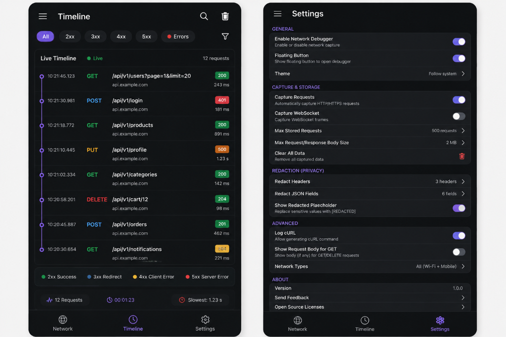
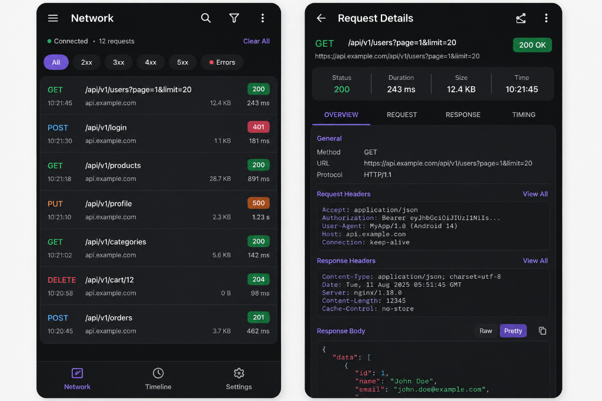

# 🌐 Network Debugger for Android & iOS (Native & KMP)

[](https://jitpack.io/#HariKulhari06/network-debugger)
[](LICENSE)
[](https://developer.android.com)
[](https://kotlinlang.org)

**Network Debugger** is a lightweight, Chrome DevTools / Proxyman-style in-app network inspection SDK embedded directly inside your **Android** and **iOS** applications.

We offer two solutions side-by-side:
1. **🤖 Native Android SDK** (`network-debugger`): A pure native Android library (`.aar`) optimized for OkHttp, Room, and Jetpack Compose.
2. **🌍 Kotlin Multiplatform SDK** (`network-debugger-kmp`): A shared multiplatform library targeting `commonMain`, `androidMain`, and `iosMain` (XCFramework for Xcode / Swift).

---

## 📱 Screenshots & Demo Video

| Network Event Inspector | Request Details & cURL |
| :---: | :---: |
|  |  |

> 📹 **Video File**: [`screenshot/demo.mp4`](screenshot/demo.mp4)

---

## 📦 Installation

Add **JitPack** to your project's `settings.gradle.kts`:

```kotlin
dependencyResolutionManagement {
    repositories {
        google()
        mavenCentral()
        maven { url = uri("https://jitpack.io") }
    }
}
```

### Option A: Native Android App

```kotlin
dependencies {
    // Pure native Android SDK
    debugImplementation("com.github.HariKulhari06:network-debugger:1.1.1")
}
```

### Option B: Kotlin Multiplatform App (Android & iOS)

```kotlin
// commonMain sourceSet
kotlin {
    sourceSets {
        commonMain.dependencies {
            implementation("com.github.HariKulhari06:network-debugger-kmp:1.1.1")
        }
    }
}
```

### Option C: Native iOS App (Xcode / Swift)

Include `NetworkDebuggerKMP.xcframework` via **Swift Package Manager (SPM)** or CocoaPods:

```swift
import NetworkDebuggerKMP

NetworkDebuggerKmp.shared.configure(enabled: true)
```

---

## 🚀 Quickstart Guide (Android)

### 1. Initialize in Application Class

```kotlin
class DemoApplication : Application() {
    override fun onCreate() {
        super.onCreate()

        NetworkDebugger.initialize(
            context = this,
            config = NetworkDebuggerConfig(
                enabled = BuildConfig.DEBUG,
                showFloatingButton = true
            )
        )
    }
}
```

### 2. Attach Interceptor to OkHttpClient

```kotlin
val okHttpClient = OkHttpClient.Builder()
    .addInterceptor(NetworkDebugger.interceptor)
    .eventListenerFactory(NetworkDebugger.timingEventListenerFactory)
    .build()
```

---

## ✍️ Manual Capture API

For networking stacks that cannot use OkHttp interceptors (e.g., custom sockets, WebSockets, or legacy HTTPURLConnection):

```kotlin
val manualCall = NetworkDebugger.startManualRequest(
    method = "POST",
    url = "https://api.example.com/v1/checkout"
)

manualCall.requestHeaders(mapOf("Authorization" to "Bearer token123"))
         .requestBody("""{"item_id": 42, "quantity": 1}""", "application/json")

// On response received:
manualCall.response(
    statusCode = 200,
    headers = mapOf("Content-Type" to "application/json"),
    body = """{"status": "success", "order_id": "ORD-9912"}""",
    contentType = "application/json"
)
```

---

## 🛠 Project Architecture

```text
network-debugger/
├── network-debugger/              # 🤖 Native Android SDK Facade
├── network-debugger-core/         # 🤖 Native Android Core Models & Pipeline
├── network-debugger-okhttp/       # 🤖 Native Android OkHttp Interceptor
├── network-debugger-manual/       # 🤖 Native Android Manual API
├── network-debugger-storage/      # 🤖 Native Android Room Storage
├── network-debugger-ui/           # 🤖 Native Android Jetpack Compose UI
├── network-debugger-demo/         # 📱 Native Android Demo App
│
└── network-debugger-kmp/          # 🌍 NEW Kotlin Multiplatform SDK (Android & iOS)
    ├── commonMain/                # Shared KMP Core, Redaction Engine & KMP Store
    ├── androidMain/               # Android KMP Target
    └── iosMain/                   # iOS KMP Target (NSURLProtocol & XCFramework Export)
```

---

## 📄 License

```text
Copyright 2026 Hari

Licensed under the Apache License, Version 2.0 (the "License");
you may not use this file except in compliance with the License.
You may obtain a copy of the License at

    http://www.apache.org/licenses/LICENSE-2.0

Unless required by applicable law or agreed to in writing, software
distributed on an "AS IS" BASIS, WITHOUT WARRANTIES OR CONDITIONS OF ANY KIND,
WITHOUT WARRANTIES OR CONDITIONS OF ANY KIND, either express or implied.
See the License for the specific language governing permissions and limitations
under the License.
```
