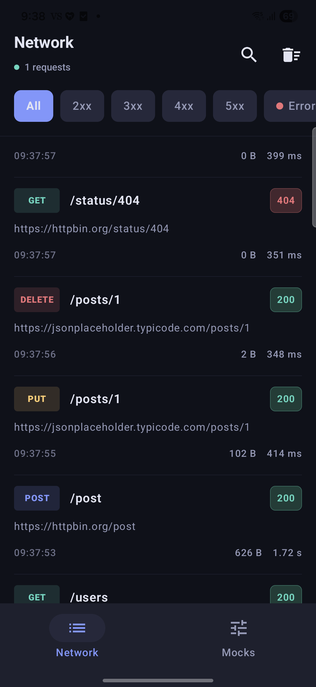
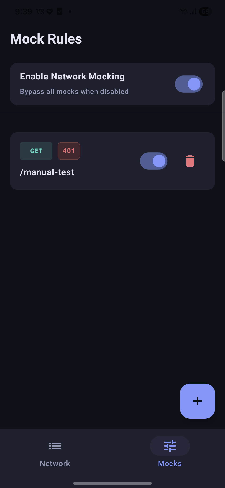
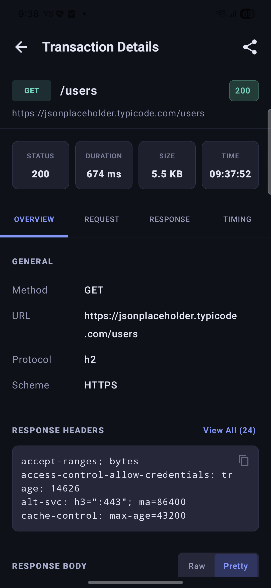

# 📡 Tracea

<p align="center">
  
</p>

<p align="center">
  <a href="https://jitpack.io/#HariKulhari06/tracea"></a>
  <a href="LICENSE"></a>
  <a href="https://developer.android.com"></a>
  <a href="https://kotlinlang.org"></a>
</p>

**Tracea** is a premium, high-performance in-app network debugger for Android. Designed to run directly inside your application with zero external proxy dependencies, it lets you inspect, mock, and analyze network traffic in real-time.

---

## 📱 Visual Overview

| Network Inspector | Mocking Rules | Detailed Analysis |
| :---: | :---: | :---: |
|  |  |  |

---

## ✨ Features

- 🔍 **Real-time Traffic Inspection** — Monitor all incoming and outgoing HTTP/HTTPS calls with color-coded status badges and request/response metrics.
- 🎭 **Dynamic API Mocking** — Define request interception rules with HTTP method selection, path matching autocomplete, custom status codes, and latency simulation. Includes master toggle switch and disk persistence.
- 📉 **DevTools Waterfall Timeline** — Visualize network latency metrics with relative timing charts indicating connection time (DNS, TCP, TLS), waiting time (TTFB), and download time.
- 🔒 **Privacy & Redaction** — Automated masking for sensitive request/response headers (e.g. `Authorization`, `Cookie`) and recursive JSON payload keys (e.g. `password`, `token`).
- 🎛️ **Session Management** — Organize transactions by debugging sessions. Expand or collapse session details, view request summaries, or delete individual sessions.
- 🔌 **Draggable Overlay Button** — A floating badge displaying live transaction counts that lets developers launch the debugger interface with a single tap from any screen.
- 📋 **Export Utilities** — Share network transactions on the fly as copyable **cURL** commands, single request **HAR** records, full-session **HAR** archives, or plain text summaries.
- 🎨 **Modern Compose UI** — A beautiful, minimalist dark-mode interface built entirely with Jetpack Compose, featuring custom JSON syntax highlighting and pretty-printing.

---

## 📦 Installation

Add the **JitPack** repository to your root `settings.gradle.kts`:

```kotlin
dependencyResolutionManagement {
    repositories {
        google()
        mavenCentral()
        maven { url = uri("https://jitpack.io") }
    }
}
```

Add the library dependency to your app module's `build.gradle.kts`:

```kotlin
dependencies {
    // Enable Tracea only in debug builds
    debugImplementation("com.github.HariKulhari06:tracea:1.0.0")
}
```

---

## 🚀 Quick Start

### 1. Initialize Tracea

Initialize Tracea in your `Application` subclass:

```kotlin
class MyApplication : Application() {
    override fun onCreate() {
        super.onCreate()

        Tracea.initialize(
            context = this,
            config = TraceaConfig(
                enabled = BuildConfig.DEBUG,
                showFloatingButton = true
            )
        )
    }
}
```

### 2. Attach Interceptor (OkHttp)

Simply add the interceptor to your `OkHttpClient` builder:

```kotlin
val okHttpClient = OkHttpClient.Builder()
    .addInterceptor(Tracea.interceptor)
    .eventListenerFactory(Tracea.timingEventListenerFactory) // Optional: Enables waterfall timing breakdown
    .build()
```

---

## 🛡️ Advanced: Manual Capture API

For network stacks that do not use OkHttp (such as Ktor, WebSockets, or legacy connection libraries):

```kotlin
// 1. Start tracking a new request
val call = Tracea.startManualRequest(method = "POST", url = "https://api.example.com/v1/users")

// 2. Set headers and payloads
call.requestHeaders(mapOf("Content-Type" to "application/json", "Authorization" to "Bearer ..."))
    .requestBody("""{"username": "johndoe"}""", "application/json")

// 3. Emit response on completion
call.response(
    statusCode = 201,
    headers = mapOf("Content-Type" to "application/json"),
    body = """{"id": 42, "status": "created"}""",
    contentType = "application/json"
)

// Or log failures/cancellations
// call.failure(IOException("Connection timeout"))
// call.cancel()
```

---

## ⚙️ Configuration & Redaction

Customize how Tracea operates and redacts sensitive data:

```kotlin
Tracea.initialize(
    context = this,
    config = TraceaConfig(
        enabled = true,
        showFloatingButton = true,
        redactionConfig = RedactionConfig(
            sensitiveHeaders = setOf("Authorization", "Cookie", "Set-Cookie", "X-Api-Key"),
            sensitiveJsonKeys = setOf("password", "token", "access_token", "secret")
        ),
        storageConfig = StorageConfig(
            maxRequests = 500 // Automatically purges oldest events to maintain footprint
        )
    )
)
```

---

## 🏗️ Architecture

Tracea consists of decoupled, modular components:
- **`tracea`**: The public facade API.
- **`tracea-core`**: Core pipeline, data structures, and redaction logic.
- **`tracea-storage`**: Database management powered by Room DB.
- **`tracea-ui`**: The user interface built with Jetpack Compose.
- **`tracea-okhttp`**: Interceptor and network timing event listener adapters.
- **`tracea-manual`**: Interface for custom network logs capture.

---

## 📄 License

Licensed under the Apache License, Version 2.0. See the [LICENSE](LICENSE) file for details.
